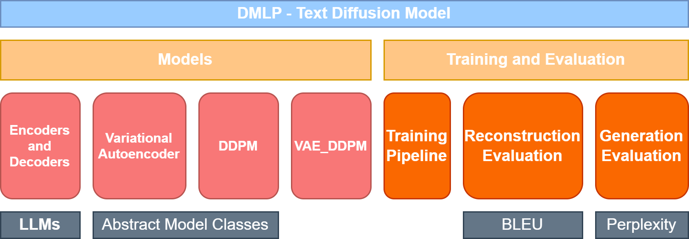
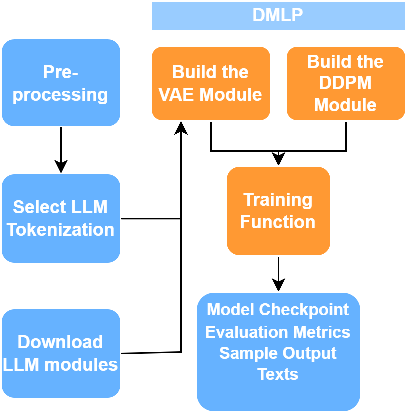

DMLP is a versatile Python library designed for the training, evaluation, and development of text diffusion models. This library focuses on an architecture synthesizing variational autoencoders (VAEs) with diffusion process, which enables text representation, reconstruction, and generation in one model. DMLP comes equipped with pre-defined functions and classes, offering users a platform to implement, experiment, and compare customized text diffusion models.

It provides:

- APIs for constructing and training/fine-tuning text diffusion model 
- Abstract classes for developing models in text diffusion

The Models module of DMLP comprises three key components: abstract VAE, abstract Diffusion, and abstract VAE_Diffusion. These elements form the fundamental structure of the JEDI model, which serves as a reference for the design of DMLP. The abstract models offer users the flexibility to implement their architectures based on their preferences. Multiple combinations of encoders and decoders, along with corresponding tokenizers, are accessible through Hugging Face. Users can simply download the models and set them as instances of our classes. \
Additionally, we have incorporated JEDI versions of the VAE and DDPM models within DMLP. This feature enables swift adaptation to new tasks, providing users with pre-configured models that can be readily employed for their specific applications. This approach streamlines the process of leveraging state-of-the-art models while offering the flexibility needed for customization. 

DMLP also provides a training and evaluation pipeline as the graph below indicated: \
